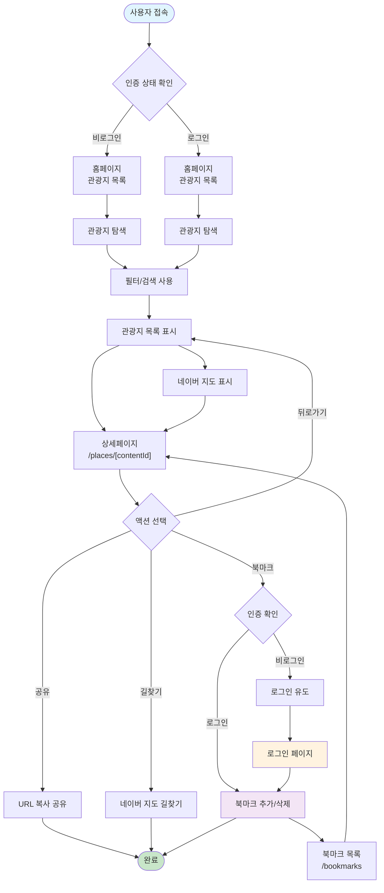
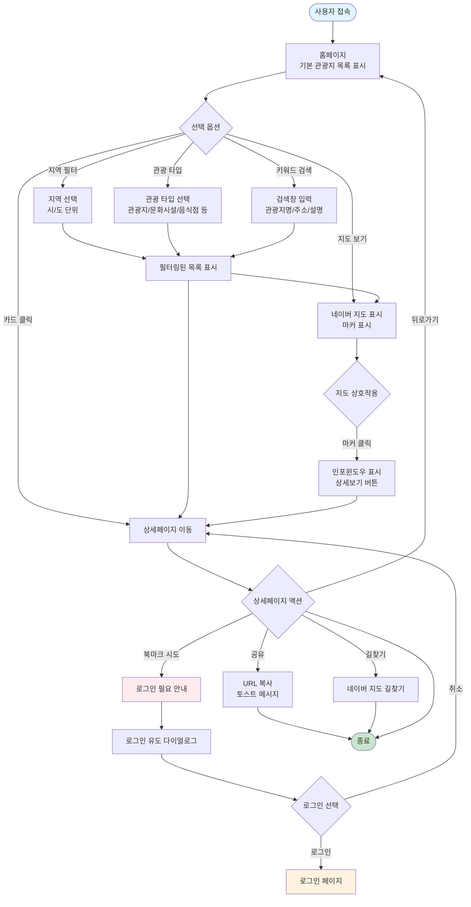
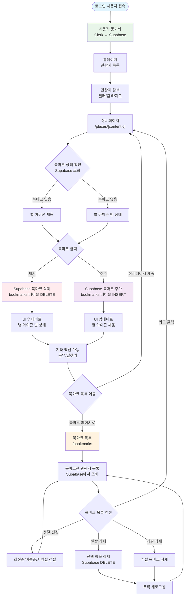
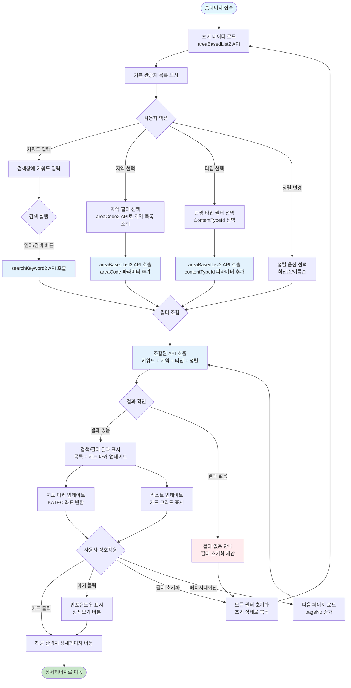
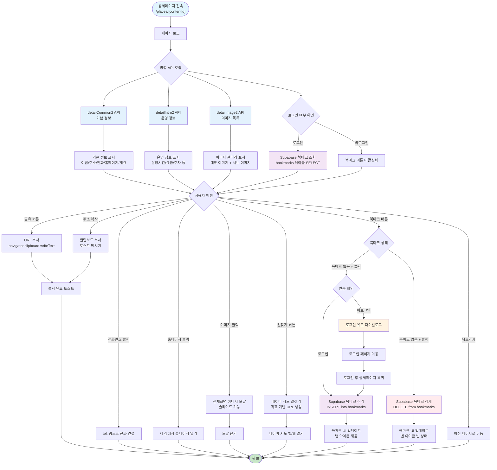
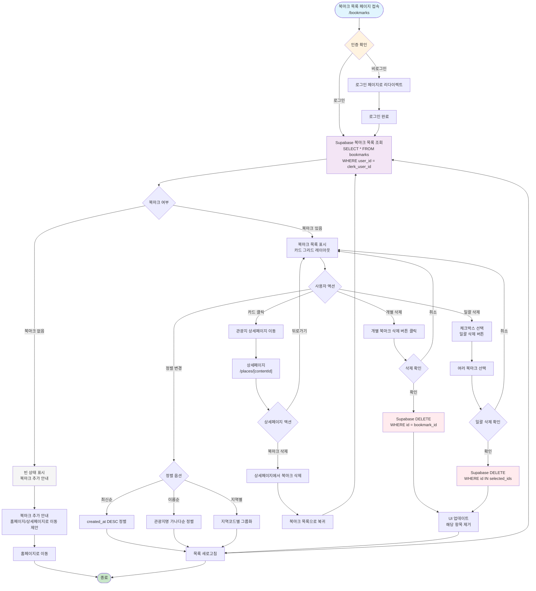
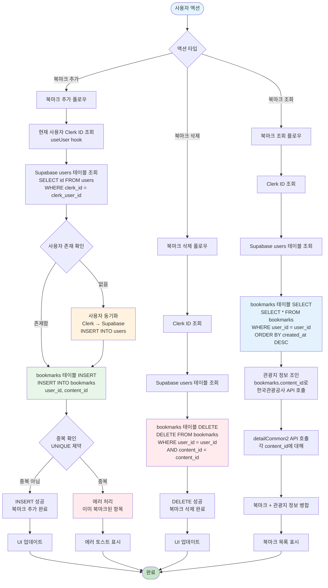
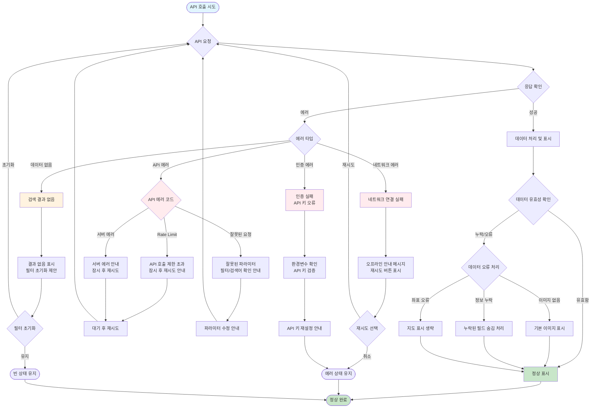

# My Trip - 유저 플로우 (User Flow)

> PRD.md 및 tour_schema.sql 기반 유저 플로우 다이어그램

---

## 1. 전체 유저 플로우 개요

---

## 2. 비로그인 유저 플로우 (기본 탐색)

---

## 3. 로그인 유저 플로우 (북마크 포함)

---

## 4. 검색 및 필터 플로우

---

## 5. 상세페이지 플로우

---

## 6. 북마크 관리 플로우

---

## 7. 데이터베이스 연동 플로우 (Supabase)

---

## 8. 에러 처리 및 예외 플로우

---

## 주요 엔드포인트 및 데이터 흐름 요약

### 페이지 라우트

- `/` - 홈페이지 (관광지 목록 + 필터 + 지도)
- `/places/[contentId]` - 상세페이지
- `/bookmarks` - 북마크 목록 (로그인 필요)

### 주요 API 호출

- **한국관광공사 API**:

  - `areaCode2` - 지역코드 조회
  - `areaBasedList2` - 지역 기반 관광정보 조회
  - `searchKeyword2` - 키워드 검색
  - `detailCommon2` - 상세 기본 정보
  - `detailIntro2` - 상세 운영 정보
  - `detailImage2` - 이미지 목록

- **Supabase**:
  - `bookmarks` 테이블 - 북마크 데이터 저장
  - `users` 테이블 - Clerk 사용자 동기화

### 데이터베이스 스키마 (tour_schema.sql)

- `users` 테이블: `id`, `clerk_id`, `name`, `created_at`
- `bookmarks` 테이블: `id`, `user_id`, `content_id`, `created_at`
  - UNIQUE 제약: `(user_id, content_id)`
  - 인덱스: `user_id`, `content_id`, `created_at`

---

## 플로우 다이어그램 사용 가이드

1. **전체 플로우 개요**: 프로젝트의 전체적인 사용자 여정을 파악
2. **비로그인 유저 플로우**: 인증 없이 사용 가능한 기능 중심
3. **로그인 유저 플로우**: 북마크 기능이 포함된 전체 플로우
4. **검색 및 필터 플로우**: 관광지 탐색 기능의 상세 흐름
5. **상세페이지 플로우**: 상세페이지의 모든 기능과 상호작용
6. **북마크 관리 플로우**: 북마크 목록 페이지의 기능
7. **데이터베이스 연동 플로우**: Supabase와의 데이터 동기화 과정
8. **에러 처리 플로우**: 예외 상황 및 에러 처리 방법

---

## 참고 사항

- **RLS 정책**: 개발 환경에서는 비활성화되어 있으며, 프로덕션 배포 전 반드시 활성화 필요
- **Clerk 인증**: 북마크 기능은 인증된 사용자만 사용 가능
- **좌표 변환**: KATEC 좌표계를 사용하므로 `mapx`, `mapy` 값을 `10000000`으로 나누어 변환
- **API Rate Limit**: 한국관광공사 API 호출 제한 확인 필요
- **네이버 지도**: 월 10,000,000건 무료 제한 확인 필요
